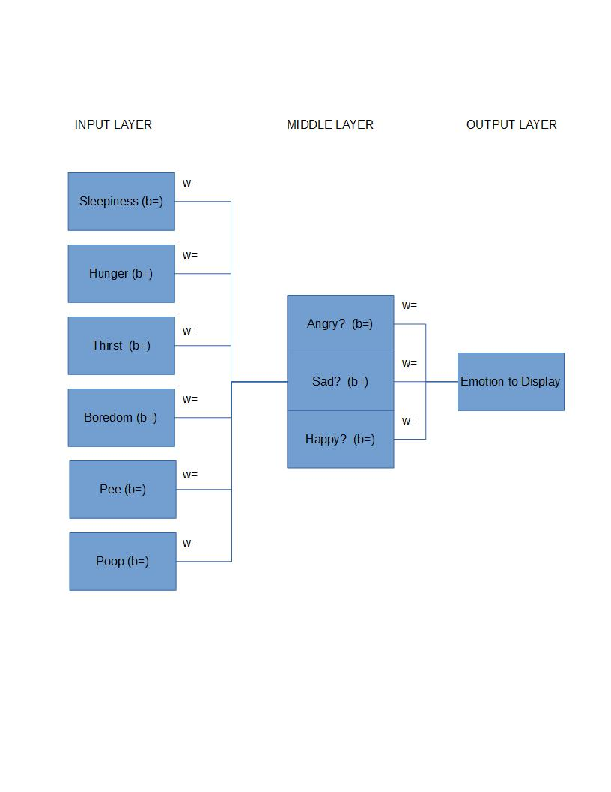

#DotNetPet

## Neural Network Diagrams

### Emotion Display

**Work in Progress**

### Planning

#### Network Classes

##### Network

Orchestrates NetworkNode Classes and provides structure

##### NetworkNode

- NetworkNode[] parents: References to all parent nodes
- NetworkNode[] children: References to all child nodes
- SigmoidNeuron neuron: This node's SigmoidNeuron instance
- double weight: This node's weight
- NeuronInput Fire(NeuronInput[]): Run the SigmoidNeuron's logistic function with the list of inputs and return new inputs
